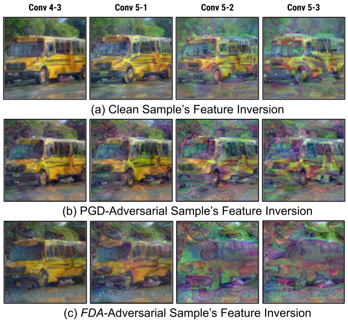

# FDA: Feature Disruptive Attack

#### Aditya Ganeshan, B.S. Vivek, and R. Venkatesh Babu

##### IEEE / CVF International Conference on Computer Vision 2019 (ICCV'19)

<p align="center">
  
</p>

This repository contains code for our recently published adversarial attack **FDA**. 

Our work focuses on attacking and 
disrupting the features of adversarial samples, which make them useless for multiple tasks. 

For more information read our paper here!

For a detailed Collab notebook Walkthrough checkout here!

The code is implemented in TensorFlow with the use of `TF-slim` and `CleverHans`.

## Instruction

1) Fetch the required libraries: 

```
git clone https://github.com/BardOfCodes/cleverhans.git

git clone https://github.com/BardOfCodes/models.git
```

2) Fetch the required dataset and other files. The test dataset is a subset of the ImageNet 2012 ILSVRC dataset 
established in NIPS 2017 (NeurIPS now) challenge dataset (based on `cleverhans/examples/nips17_adversarial_competition/dataset/final_dataset.csv`).

```
# Fetch the dataset from my dropbox!
cd assets
wget https://www.dropbox.com/s/mi1nnywrvagsalo/mini_imagenet.tar?dl=1
mv 'mini_imagenet.tar?dl=1' mini.tar
tar -xvf mini.tar

# fetch the models
cd models
./model_fetch.sh
```

3) Run the test configuration:
```
# if required, install the required python packages:
pip install -r requirements.txt

# add path to CleverHans and TF-Slim in pythonpath
export PYTHONPATH="$PWD/cleverhans:$PWD/models/research/:$PYTHONPATH"

# run the evaluation script.
python scripts/run_eval.py --config config/test_config.yaml
```

The model should show print the results and also log more information in the results folder.

## Acknowledgement:
I would like to thank:

1) My many friends, mentors and colleagues from Video Analytics Labs for having multiple ad-hoc 
discussions on this work and giving valuable suggestions.

2) Preferred Networks Inc for providing the freedom to pursue personal research directions.

#### Note: The code for many other ablations in the paper can be found in this repository (warning: code is messy).

